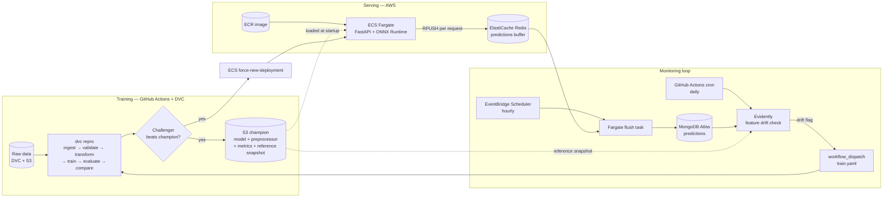

# FraudGuard

[](https://github.com/nls-forev/FraudGuard/actions/workflows/ci.yaml)
[](https://github.com/nls-forev/FraudGuard/actions/workflows/train.yaml)
[](https://github.com/nls-forev/FraudGuard/actions/workflows/deploy.yaml)
[](https://github.com/nls-forev/FraudGuard/actions/workflows/detect_drift.yaml)

Production-grade MLOps system for bank account fraud detection — from raw data
to a live API on AWS, with the full loop automated: **train → gate → deploy →
monitor → detect drift → retrain**.

The model is XGBoost on the [Bank Account Fraud
(NeurIPS 2022)](https://www.kaggle.com/datasets/sgpjesus/bank-account-fraud-dataset-neurips-2022)
tabular dataset, exported to ONNX.

## Architecture



## How the loop closes

1. **Serve** — FastAPI + ONNX Runtime on ECS Fargate. The container downloads
   the current champion bundle (model, preprocessor, metrics) from S3 at
   startup, so a model rollout is just a service restart — no image rebuild.
2. **Log** — every `/predict` response is pushed to an ElastiCache Redis list.
   The write is wrapped so a Redis outage can never fail an inference request,
   and it adds no Mongo latency to the hot path.
3. **Flush** — an EventBridge-scheduled Fargate task drains the buffer into
   MongoDB hourly (insert-before-trim: at-least-once delivery, records pushed
   mid-flush survive).
4. **Detect** — a daily GitHub Actions cron runs Evidently's `DataDriftPreset`
   over all 29 feature columns: the champion's held-out split (exported to S3
   at promotion time) vs the last 7 days of live traffic. The HTML report is
   archived to S3.
5. **Retrain** — if the share of drifted columns crosses the threshold, the
   workflow dispatches `train.yaml`. The challenger only ships if it beats the
   champion's metrics; promotion uploads new champion artifacts *and* a fresh
   drift reference, then restarts the ECS service.

Feature drift (not label drift) is the retraining signal by design: confirmed
fraud labels lag live traffic by weeks (chargebacks), so waiting for label
drift means detecting problems a month late.

## Stack

| Concern | Tool |
|---|---|
| Data versioning | DVC (S3 remote) |
| Pipeline | DVC stages → `src/pipeline/run_stage.py` |
| Data validation | Pandera + schema config |
| Model | XGBoost → ONNX, served with ONNX Runtime |
| Serving | FastAPI + Uvicorn on ECS Fargate |
| Registry / artifacts | S3 (champion/challenger layout) + SageMaker Model Registry |
| Prediction logging | ElastiCache Redis → MongoDB Atlas |
| Scheduled jobs | EventBridge Scheduler → Fargate `RunTask` |
| Drift detection | Evidently |
| CI/CD | GitHub Actions |
| Secrets | SSM Parameter Store (SecureString) → ECS task secrets |
| Dependencies | uv (serving image installs the serving group only) |

## Workflows

| Workflow | Trigger | What it does |
|---|---|---|
| `ci.yaml` | every push/PR | ruff lint + secret scanning |
| `train.yaml` | push to `main` touching `src/`, `config/`, `dvc.yaml`; manual; drift dispatch | `dvc repro`, champion/challenger comparison, promotes + redeploys on a win |
| `deploy.yaml` | push to `main` touching anything baked into the image | rebuild image → push ECR → `force-new-deployment` |
| `detect_drift.yaml` | daily cron; manual | Evidently drift check; dispatches `train.yaml` when flagged |

Two deployment paths on purpose: **code changes** need an image rebuild
(`deploy.yaml`); **model promotions** only need a service restart to re-pull
the champion from S3 (`train.yaml`'s deploy job). Neither blocks the other.

## API

```bash
curl -X POST http://<host>:8000/predict \
  -H 'Content-Type: application/json' \
  -d @transaction.json
```

```json
{"fraud_probability": 0.022064208984375, "is_fraud": 0}
```

The request schema (29 features, bounds and categorical domains enforced with
Pydantic) lives in `src/api/schema.py`.

## Repository layout

```
src/
├── api/            FastAPI app + request/response schema
├── components/     pipeline stages (ingestion → validation → transformation
│                   → training → evaluation → comparison → pusher)
├── configuration/  MongoDB client
├── constants/      all paths, S3 keys, thresholds
├── data_access/    S3/SageMaker ops, Redis client, Mongo data export
├── entity/         config + artifact dataclasses
├── monitoring/     flush_predictions.py, detect_drift.py
├── pipeline/       run_stage.py (DVC entrypoints)
└── utils/          model loader, feature engineering, helpers
config/             schema.yaml (feature contract), hyperparams.yaml
dvc.yaml            6-stage reproducible pipeline
Dockerfile          slim serving image (uv, serving deps only, ~no training libs)
```

## Running locally

```bash
uv sync                          # everything (training + dev groups)
uv run dvc pull                  # data + artifacts from S3
uv run dvc repro                 # full training pipeline
uv run uvicorn src.api.app:app   # serve (downloads champion from S3)
```

Required environment (`.env` for local, task-def secrets in ECS):
`CONNECTION_URL` (MongoDB Atlas), `REDIS_URL` (defaults to localhost), AWS
credentials with S3 read.

## Design decisions

- **Redis buffer between `/predict` and Mongo** — no per-request Mongo write
  latency, no hammering the database with tiny documents. Accepted trade-off:
  a small loss window if Redis dies before a flush; fine for prediction
  *logging*, never for anything transactional.
- **Champion loaded from S3 at container startup** — decouples the model
  lifecycle from the image lifecycle. Model rollouts and rollbacks are service
  restarts.
- **Promotion gate in CI, not in serving** — the API never sees a model that
  hasn't beaten the incumbent on the held-out split.
- **`executionRoleArn` vs `taskRoleArn`** — the ECS agent's permissions (pull
  image, write logs, read SSM secrets) and the app's permissions (S3 model
  download) are separate roles; conflating them is the classic Fargate
  crash-loop.
- **Serving image stays lean** — `uv sync --no-default-groups` keeps training
  deps (xgboost, sagemaker, ~1GB) out of the runtime container.
