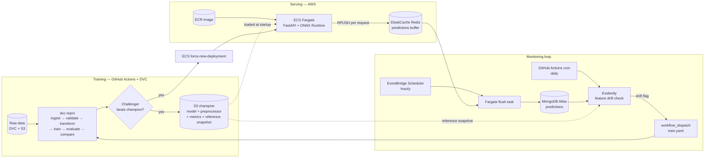

# FraudGuard

[](https://github.com/nls-forev/FraudGuard/actions/workflows/ci.yaml)
[](https://github.com/nls-forev/FraudGuard/actions/workflows/train.yaml)
[](https://github.com/nls-forev/FraudGuard/actions/workflows/deploy.yaml)
[](https://github.com/nls-forev/FraudGuard/actions/workflows/detect_drift.yaml)

An MLOps system for bank account fraud detection that runs the whole loop
without a human in it: train, gate, deploy, monitor, detect drift, retrain.

The model is XGBoost on the [Bank Account Fraud
(NeurIPS 2022)](https://www.kaggle.com/datasets/sgpjesus/bank-account-fraud-dataset-neurips-2022)
tabular dataset, exported to ONNX.

## Architecture



## How the loop closes

1. Serving runs FastAPI and ONNX Runtime on ECS Fargate. The container pulls
   the current champion bundle (model, preprocessor, metrics) from S3 at
   startup, so shipping a new model is a service restart, not an image
   rebuild.
2. Every `/predict` response gets pushed onto an ElastiCache Redis list. The
   write is wrapped so a dead Redis can't fail an inference request, and it
   keeps Mongo off the hot path entirely.
3. An EventBridge-scheduled Fargate task drains the buffer into MongoDB every
   hour. It inserts before it trims, which gives at-least-once delivery and
   lets records pushed mid-flush survive.
4. A daily GitHub Actions cron runs Evidently's `DataDriftPreset` over all 29
   feature columns, comparing the champion's held-out split (exported to S3 at
   promotion time) against the last 7 days of live traffic. The HTML report
   goes to S3.
5. If the share of drifted columns crosses the threshold, the workflow
   dispatches `train.yaml`. A challenger only ships if it beats the champion's
   metrics. Promotion uploads new champion artifacts plus a fresh drift
   reference, then restarts the ECS service.

Retraining triggers on feature drift rather than label drift, because
confirmed fraud labels arrive weeks late via chargebacks. Wait for label
drift and you find out about the problem a month after it started.

## Stack

| Concern | Tool |
|---|---|
| Data versioning | DVC (S3 remote) |
| Pipeline | DVC stages → `src/pipeline/run_stage.py` |
| Data validation | Pandera + schema config |
| Model | XGBoost → ONNX, served with ONNX Runtime |
| Serving | FastAPI + Uvicorn on ECS Fargate |
| Registry / artifacts | S3 (champion/challenger layout) + SageMaker Model Registry |
| Prediction logging | ElastiCache Redis → MongoDB Atlas |
| Scheduled jobs | EventBridge Scheduler → Fargate `RunTask` |
| Drift detection | Evidently |
| CI/CD | GitHub Actions |
| Secrets | SSM Parameter Store (SecureString) → ECS task secrets |
| Dependencies | uv (serving image installs the serving group only) |

## Workflows

| Workflow | Trigger | What it does |
|---|---|---|
| `ci.yaml` | every push/PR | ruff lint + secret scanning |
| `train.yaml` | push to `main` touching `src/`, `config/`, `dvc.yaml`; manual; drift dispatch | `dvc repro`, champion/challenger comparison, promotes + redeploys on a win |
| `deploy.yaml` | push to `main` touching anything baked into the image | rebuild image → push ECR → `force-new-deployment` |
| `detect_drift.yaml` | daily cron; manual | Evidently drift check; dispatches `train.yaml` when flagged |

There are two deployment paths on purpose. Code changes need an image rebuild
(`deploy.yaml`). Model promotions only need a service restart so the container
re-pulls the champion from S3 (the deploy job inside `train.yaml`). Neither
one blocks the other.

## API

```bash
curl -X POST http://<host>:8000/predict \
  -H 'Content-Type: application/json' \
  -d @transaction.json
```

```json
{"fraud_probability": 0.022064208984375, "is_fraud": 0}
```

The request schema lives in `src/api/schema.py`: 29 features, with bounds and
categorical domains enforced by Pydantic.

## Repository layout

```
src/
├── api/            FastAPI app + request/response schema
├── components/     pipeline stages (ingestion → validation → transformation
│                   → training → evaluation → comparison → pusher)
├── configuration/  MongoDB client
├── constants/      all paths, S3 keys, thresholds
├── data_access/    S3/SageMaker ops, Redis client, Mongo data export
├── entity/         config + artifact dataclasses
├── monitoring/     flush_predictions.py, detect_drift.py
├── pipeline/       run_stage.py (DVC entrypoints)
└── utils/          model loader, feature engineering, helpers
config/             schema.yaml (feature contract), hyperparams.yaml
dvc.yaml            6-stage reproducible pipeline
Dockerfile          slim serving image (uv, serving deps only, ~no training libs)
```

## Running locally

```bash
uv sync                          # everything (training + dev groups)
uv run dvc pull                  # data + artifacts from S3
uv run dvc repro                 # full training pipeline
uv run uvicorn src.api.app:app   # serve (downloads champion from S3)
```

Environment needed (`.env` locally, task-def secrets in ECS): `CONNECTION_URL`
for MongoDB Atlas, `REDIS_URL` (defaults to localhost), and AWS credentials
with S3 read.

## Design decisions

A Redis buffer sits between `/predict` and Mongo so requests never pay for a
Mongo write and the database never gets hammered with tiny documents. The
trade-off is a small loss window if Redis dies before a flush. That's
acceptable for prediction logging and would not be for anything transactional.

The champion loads from S3 at container startup, which separates the model
lifecycle from the image lifecycle. Rollouts and rollbacks are both service
restarts.

The promotion gate lives in CI, not in serving, so the API never sees a model
that failed to beat the incumbent on the held-out split.

`executionRoleArn` and `taskRoleArn` are separate on purpose. The ECS agent
needs to pull the image, write logs, and read SSM secrets; the app needs to
download the model from S3. Conflating the two is the classic Fargate
crash-loop.

The serving image stays lean because `uv sync --no-default-groups` keeps
training dependencies (xgboost, sagemaker, roughly 1GB of them) out of the
runtime container.
